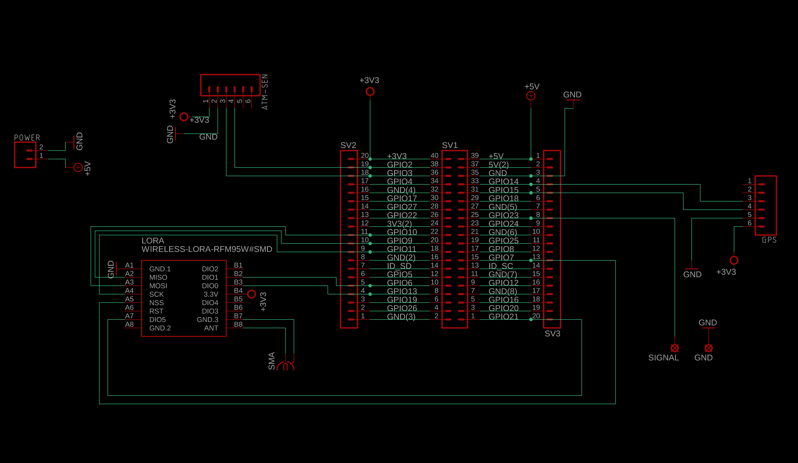

# Raspberry Zero LoRa HAB HAT
With breakout pins and optional BME280 environmental sensor mount.

  

## BOM

| component  | Version  | Link  | Notes |
|---|---|---|---|
| Raspberry Pi Zero  | 1.3  | https://thepihut.com/products/raspberry-pi-zero |   |
| LoRa Module  | -  | https://store.uputronics.com/index.php?route=product/product&path=61&product_id=69  | (434MHz)  |
| uBLOX MAX-M8C  | -  | https://store.uputronics.com/index.php?route=product/product&path=60_64&product_id=72  | Chip Antenna |
| BME 280 Environmental Sensor   | -  | https://www.aliexpress.com/premium/bme280-sensor.html?d=y | optional |
| SMA Connector | - | - | - |
| Power Connector | - | - | - |

