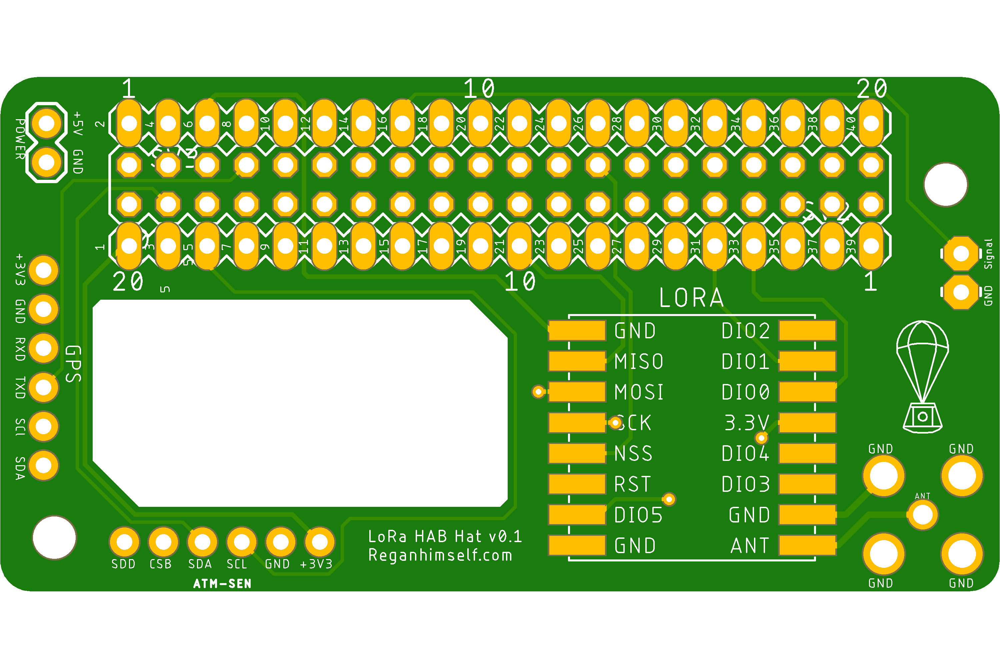
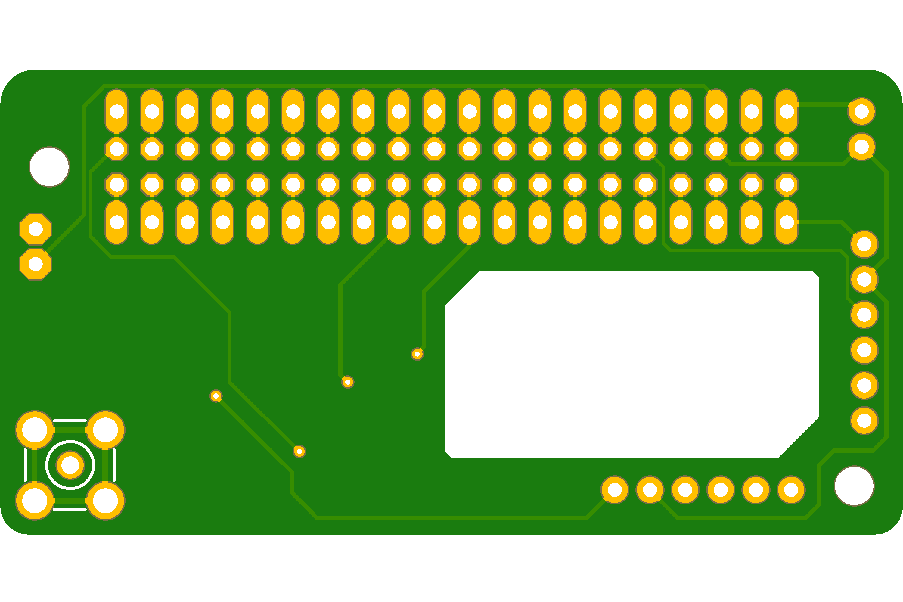
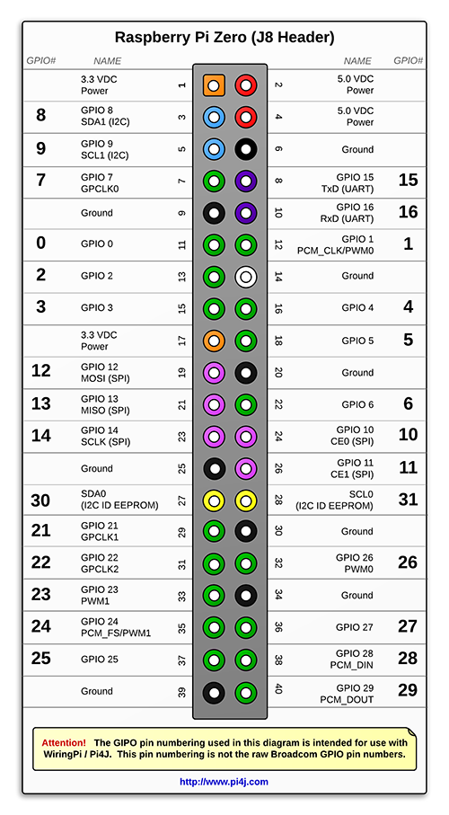

# Raspberry Zero LoRa HAB HAT
This is a Pi Hat designed to work with a Raspberry Pi. It was specifically designed to work with Raspberry Pi Zero and the mounting holes are lined up with Pi Zero in mind however it should still work with any other Pi. This board is designed to transform a Pi Zero into a tracker. On the board, you will find SMD pads to solder a LoRa module on to. The board supports the following modules: RFM95, RFM95, RFM97, RFM98. There is also an option of connecting a 6 pin GPS receiver to the board if needed as well. The breakout for Rasberry Pi provides not only pins but also pads. This gives you an ability to test with jumper wires and for use have a more permanent connection.

This board was made in collaboration with . Tests and projects with this board will be on his forum.  

Here is a quick overview of the board:

# The top side
  

# Bottom side
  

# And here is the schematic for the board
  

# Our Board uses a standard Pi Zero pinout:

## BOM

| component  | Version  | Link  | Notes |
|---|---|---|---|
| Raspberry Pi Zero  | 1.3  | https://thepihut.com/products/raspberry-pi-zero |   |
| LoRa Module  | -  | https://store.uputronics.com/index.php?route=product/product&path=61&product_id=69  | (434MHz)  |
| uBLOX MAX-M8C  | -  | https://store.uputronics.com/index.php?route=product/product&path=60_64&product_id=72  | Chip Antenna |
| BME 280 Environmental Sensor   | -  | https://www.aliexpress.com/premium/bme280-sensor.html?d=y | optional |
| SMA Connector | - | - | - |
| Power Connector | - | - | - |

Gerber files, Eagle files and more can be found in the Documents Folder. 

